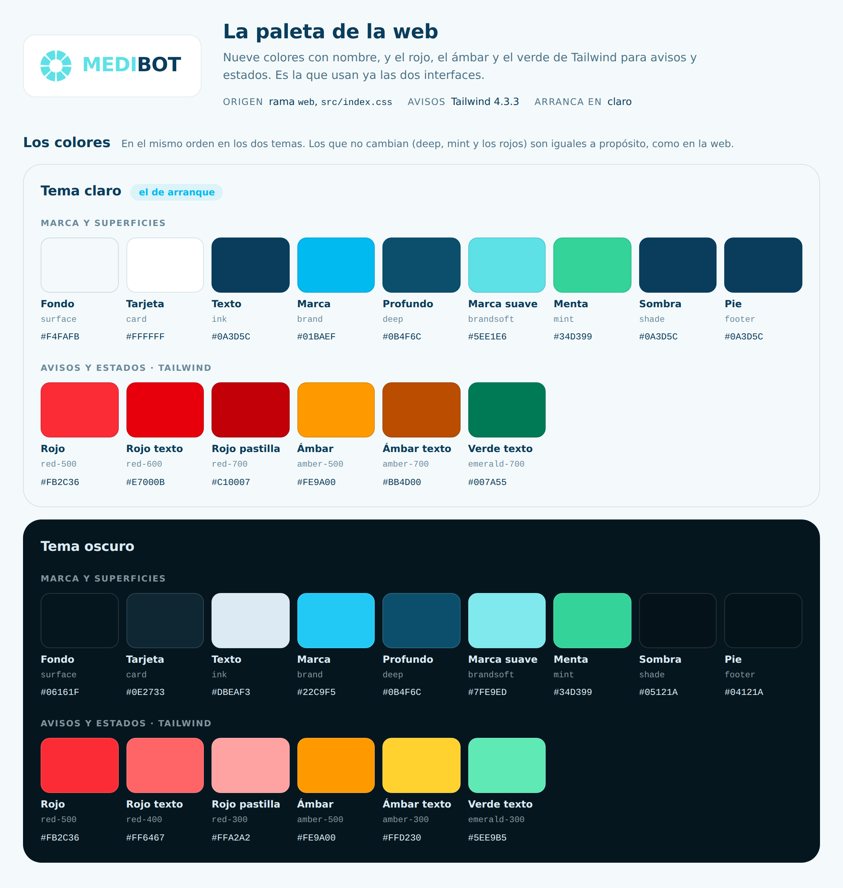

# Paleta de colores de las webs

Las interfaces web de la **cámara** (`medibot/Vision_MEDIBOT.py`, puerto 5000)
y del **pastillero** (`medibot/Pastillero.py`, puerto 5001) usan los colores
de la web de MEDIBOT: los mismos tokens de `src/index.css` de la rama
`web`, con el mismo valor, en tema claro (con el que arrancan) y oscuro.

* **`paleta_colores.html`**: la paleta completa, con cada pieza de las dos
  interfaces y el color que lleva. Se abre con doble clic en cualquier
  navegador; pulsando un color se copia su código.
* **`paleta_web.png`**: la paleta en imagen, para una presentación o un
  documento.

## La paleta de la web

| Color | De la web | Claro (de arranque) | Oscuro |
|---|---|---|---|
| Fondo | `--c-surface` | `#F4FAFB` | `#06161F` |
| Tarjeta | `--c-card` | `#FFFFFF` | `#0E2733` |
| Texto | `--c-ink` | `#0A3D5C` | `#DBEAF3` |
| Marca | `--c-brand` | `#01BAEF` | `#22C9F5` |
| Profundo | `--c-deep` | `#0B4F6C` | `#0B4F6C` |
| Marca suave | `--c-brandsoft` | `#5EE1E6` | `#7FE9ED` |
| Menta | `--c-mint` | `#34D399` | `#34D399` |
| Sombra | `--c-shade` | `#0A3D5C` | `#05121A` |
| Pie | `--c-footer` | `#0A3D5C` | `#04121A` |

Para avisos y estados, la web usa el rojo, el ámbar y el verde de Tailwind
4.3.3. Los escribe en `oklch`; las interfaces llevan ese mismo valor y, para
los navegadores que no entienden `oklch`, su equivalente en hex, que es el
que sale aquí.

| Color | Tailwind (claro · oscuro) | Claro | Oscuro |
|---|---|---|---|
| Rojo | red-500 | `#FB2C36` | `#FB2C36` |
| Rojo texto | red-600 · red-400 | `#E7000B` | `#FF6467` |
| Rojo pastilla | red-700 · red-300 | `#C10007` | `#FFA2A2` |
| Ámbar | amber-500 | `#FE9A00` | `#FE9A00` |
| Ámbar texto | amber-700 · amber-300 | `#BB4D00` | `#FFD230` |
| Verde texto | emerald-700 · emerald-300 | `#007A55` | `#5EE9B5` |

Un número tras el nombre es la transparencia, como en Tailwind: `ink/60` es
el color ink al 60 %.

Cámara · Medibot: dónde va cada color (39)

| Pieza | Dónde | Token | Claro | Oscuro |
|---|---|---|---|---|
| **Superficies** | | | | |
| Fondo de la página | Detrás de todo y en la pantalla de carga | `--c-surface` = surface | `#F4FAFB` | `#06161F` |
| Contenedor | El recuadro que lo agrupa todo | `--c-card` = card | `#FFFFFF` | `#0E2733` |
| Recuadros | Las cámaras, «Estado Sistema» y las tarjetas de vídeo | `--c-surface` = surface | `#F4FAFB` | `#06161F` |
| Casillas de dato | «Estado» y «Grabando», debajo de cada cámara; también Reproducir y Descargar | `--c-ink-5` = ink/5 | `rgba(10, 61, 92, 0.05)` | `rgba(219, 234, 243, 0.05)` |
| Bordes | Contenedor, recuadros y marco del vídeo; Reproducir y Descargar al pasar el ratón | `--c-ink-10` = ink/10 | `rgba(10, 61, 92, 0.1)` | `rgba(219, 234, 243, 0.1)` |
| Borde de los botones | Botones de control, de movimiento y el control de velocidad | `--c-ink-15` = ink/15 | `rgba(10, 61, 92, 0.15)` | `rgba(219, 234, 243, 0.15)` |
| Fondo del vídeo | Detrás de la imagen y en pantalla completa | `--c-shade` = shade | `#0A3D5C` | `#05121A` |
| Miniatura de vídeo | Como el vídeo de la web: de deep a shade | deep → shade | degradado deep → shade | degradado deep → shade |
| **Texto** | | | | |
| Texto principal | Valores, títulos de cámara y de vídeo, y el «BOT» del logotipo | `--c-ink` = ink | `#0A3D5C` | `#DBEAF3` |
| Letra de botones y etiquetas | Botones de control, de movimiento, de velocidad, Pastillero y Modo; «Estado», «Velocidad» | `--c-ink-70` = ink/70 | `rgba(10, 61, 92, 0.7)` | `rgba(219, 234, 243, 0.7)` |
| Texto secundario | Datos de cada vídeo, «VISIÓN ARTIFICIAL» y el pie | `--c-ink-60` = ink/60 | `rgba(10, 61, 92, 0.6)` | `rgba(219, 234, 243, 0.6)` |
| Rótulo «ESTADO SISTEMA» | Como los rótulos en mayúsculas de la web | `--c-brand` = brand | `#01BAEF` | `#22C9F5` |
| **Marca** | | | | |
| La rueda y «MEDI» | La rueda de la web: en la cabecera (girando), en la pantalla de carga y como bola del joystick; y la primera mitad del nombre | `--c-brandsoft` = brandsoft | `#5EE1E6` | `#7FE9ED` |
| Brillo del contenedor | Halo alrededor del recuadro principal | `--c-brand-5` = brand/5 | `rgba(1, 186, 239, 0.05)` | `rgba(34, 201, 245, 0.05)` |
| Icono de la pestaña | La rueda, como el favicon de la web: sigue al tema del sistema | brandsoft · brand | `#01BAEF` | `#7FE9ED` |
| **Botones y mandos** | | | | |
| Botón activo | «Detener Sistema», «Reconocimiento: ON», «Control de velocidad: ON», un movimiento pulsado, el altavoz escuchando | brand → deep | degradado brand → deep | degradado brand → deep |
| Letra sobre el degradado | Siempre blanca, como en la web | `--c-blanco` = white | `#FFFFFF` | `#FFFFFF` |
| Borde al pasar el ratón | Botones de control y de movimiento | `--c-brand-30` = brand/30 | `rgba(1, 186, 239, 0.3)` | `rgba(34, 201, 245, 0.3)` |
| Pastillero y Modo al pasar el ratón | Fondo | `--c-ink-5` = ink/5 | `rgba(10, 61, 92, 0.05)` | `rgba(219, 234, 243, 0.05)` |
| Botonera de movimiento | Fondo de los botones | `--c-card` = card | `#FFFFFF` | `#0E2733` |
| Barra de velocidad y aro del joystick | Con la velocidad bloqueada, la barra se ve más apagada | `--c-brand` = brand | `#01BAEF` | `#22C9F5` |
| Brillo del joystick | Halo de la rueda que hace de bola | `--c-brand-40` = brand/40 | `rgba(1, 186, 239, 0.4)` | `rgba(34, 201, 245, 0.4)` |
| **Estados y avisos** | | | | |
| Cámara en marcha | Título de la cámara activa | `--c-exito-texto` = emerald-300 · emerald-700 | `#007A55` | `#5EE9B5` |
| Punto: cámara activa | Junto al título | `--c-mint` = mint | `#34D399` | `#34D399` |
| Punto: cámara parada | El mismo punto; también PARAR pulsado | `--c-rojo` = red-500 | `#FB2C36` | `#FB2C36` |
| Letra roja | «Sí» en Grabando, PARAR y el aviso de la velocidad | `--c-rojo-texto` = red-400 · red-600 | `#E7000B` | `#FF6467` |
| Botón grabando | Fondo de «Detener Grabación» | `--c-rojo-15` = red-500/15 | `rgba(251, 44, 54, 0.15)` | `rgba(251, 44, 54, 0.15)` |
| Letra del botón grabando | Como las pastillas de alerta de la web | `--c-rojo-pastilla` = red-300 · red-700 | `#C10007` | `#FFA2A2` |
| Borde rojo | PARAR y el botón grabando | `--c-rojo-30` = red-500/30 | `rgba(251, 44, 54, 0.3)` | `rgba(251, 44, 54, 0.3)` |
| PARAR al pasar el ratón | Fondo | `--c-rojo-10` = red-500/10 | `rgba(251, 44, 54, 0.1)` | `rgba(251, 44, 54, 0.1)` |
| Barra de avisos | Franja de arriba cuando algo falla | `--c-rojo-fuerte` = red-600 | `#E7000B` | `#E7000B` |
| Barra de avisos grave | Cuando falla la propia página | `--c-rojo-grave` = red-700 | `#C10007` | `#C10007` |
| **Sobre el vídeo** | | | | |
| Botones sobre el vídeo | Altavoz, micrófono, Pantalla completa y «Dir:» del joystick; sombra de la barra de avisos | `--c-velo` = footer oscuro al 60 % | `rgba(4, 18, 26, 0.6)` | `rgba(4, 18, 26, 0.6)` |
| Botones sobre el vídeo al pasar el ratón | Los mismos | `--c-velo-fuerte` = footer oscuro al 80 % | `rgba(4, 18, 26, 0.8)` | `rgba(4, 18, 26, 0.8)` |
| Borde de esos botones | Al pasar el ratón o escuchando, brandsoft | `--c-blanco-35` = white/35 | `rgba(255, 255, 255, 0.35)` | `rgba(255, 255, 255, 0.35)` |
| Texto de la miniatura | Nombre de la cámara en cada vídeo | `--c-blanco-70` = white/70 | `rgba(255, 255, 255, 0.7)` | `rgba(255, 255, 255, 0.7)` |
| Hablando | Micrófono mientras mantienes pulsado | `--c-rojo-90` = red-500/90 | `rgba(251, 44, 54, 0.9)` | `rgba(251, 44, 54, 0.9)` |
| Borde al hablar | El mismo botón | `--c-rojo-claro` = red-300 | `#FFA2A2` | `#FFA2A2` |
| Latido al hablar | Anillo que late alrededor del botón | `--c-rojo-55` = red-500/55 | `rgba(251, 44, 54, 0.55)` | `rgba(251, 44, 54, 0.55)` |

Pastillero · Pillbox: sus variables y de qué color de la web salen (34)

| Variable | Para qué | De la web | Claro | Oscuro |
|---|---|---|---|---|
| **Superficies** | | | | |
| `--fondo` | Detrás de todo | surface | `#F4FAFB` | `#06161F` |
| `--tarjeta` | Recuadro principal, tarjetas de compartimiento, campos y casillas de días | card | `#FFFFFF` | `#0E2733` |
| `--panel` | Formulario, datos guardados, historial y horarios | surface | `#F4FAFB` | `#06161F` |
| `--suave` | Botones de arriba, «Volver al menu», horario en pausa y pastilla «sin verificar» | ink/5 | `rgba(10, 61, 92, 0.05)` | `rgba(219, 234, 243, 0.05)` |
| `--suave-hover` | Los botones de arriba al pasar el ratón | ink/10 | `rgba(10, 61, 92, 0.1)` | `rgba(219, 234, 243, 0.1)` |
| **Bordes** | | | | |
| `--borde` | Tarjetas, paneles y líneas entre filas | ink/10 | `rgba(10, 61, 92, 0.1)` | `rgba(219, 234, 243, 0.1)` |
| `--borde-fuerte` | Campos, hora, casillas de días y botones de contorno | ink/15 | `rgba(10, 61, 92, 0.15)` | `rgba(219, 234, 243, 0.15)` |
| `--borde-activo` | Tarjeta de compartimiento y casillas al pasar el ratón | brand/30 | `rgba(1, 186, 239, 0.3)` | `rgba(34, 201, 245, 0.3)` |
| `--borde-hover` | Editar, Cancelar y Pausar al pasar el ratón | brand/40 | `rgba(1, 186, 239, 0.4)` | `rgba(34, 201, 245, 0.4)` |
| **Texto** | | | | |
| `--texto-titulo` | Títulos, número de compartimiento, datos guardados y letra de los botones de arriba | ink | `#0A3D5C` | `#DBEAF3` |
| `--texto` | Texto normal, etiquetas del formulario y botones de contorno | ink/70 | `rgba(10, 61, 92, 0.7)` | `rgba(219, 234, 243, 0.7)` |
| `--texto-tenue` | Subtítulos, etiquetas en mayúsculas, fechas y avisos | ink/60 | `rgba(10, 61, 92, 0.6)` | `rgba(219, 234, 243, 0.6)` |
| `--texto-pastilla` | Pastillas neutras: «Pausado» y «sin verificar» | ink/50 | `rgba(10, 61, 92, 0.5)` | `rgba(219, 234, 243, 0.5)` |
| `--texto-debil` | «Sin datos» y el texto de ejemplo de los campos | ink/40 | `rgba(10, 61, 92, 0.4)` | `rgba(219, 234, 243, 0.4)` |
| **Marca** | | | | |
| `--acento` | Contador, «Pendiente», días del horario, campo activo, acciones MANUAL | brand | `#01BAEF` | `#22C9F5` |
| `--acento-fin` | Final del degradado | deep | `#0B4F6C` | `#0B4F6C` |
| Botón principal | Dispensar, Completado y Agregar horario | brand → deep | degradado brand → deep | degradado brand → deep |
| `--sobre-acento` | Letra de esos botones | white | `#FFFFFF` | `#FFFFFF` |
| `--acento-suave` | Fondo del contador y de «Pendiente» | brand/10 | `rgba(1, 186, 239, 0.1)` | `rgba(34, 201, 245, 0.1)` |
| `--marca-suave` | La rueda y «MEDI» de la pantalla de carga | brandsoft | `#5EE1E6` | `#7FE9ED` |
| **Todo bien** | | | | |
| `--exito` | Acciones AUTO del historial | mint | `#34D399` | `#34D399` |
| `--exito-suave` | Fondo de «Conectado», «Sincronizado», «Completado» y horario activo | mint/15 | `rgba(52, 211, 153, 0.15)` | `rgba(52, 211, 153, 0.15)` |
| `--exito-texto` | Letra de esas pastillas | emerald-300 · emerald-700 | `#007A55` | `#5EE9B5` |
| **Peligro** | | | | |
| `--peligro-suave` | Fondo de «Desconectado» | red-500/15 | `rgba(251, 44, 54, 0.15)` | `rgba(251, 44, 54, 0.15)` |
| `--peligro-pastilla` | Letra de «Desconectado» | red-300 · red-700 | `#C10007` | `#FFA2A2` |
| `--peligro-borde` | Borde de Eliminar y Quitar | red-500/30 | `rgba(251, 44, 54, 0.3)` | `rgba(251, 44, 54, 0.3)` |
| `--peligro-texto` | Letra de Eliminar y Quitar | red-400 · red-600 | `#E7000B` | `#FF6467` |
| `--peligro-hover` | Eliminar y Quitar al pasar el ratón | red-500/10 | `rgba(251, 44, 54, 0.1)` | `rgba(251, 44, 54, 0.1)` |
| **Aviso** | | | | |
| `--aviso-suave` | Fondo de «Desincronizado» | amber-500/15 | `rgba(254, 154, 0, 0.15)` | `rgba(254, 154, 0, 0.15)` |
| `--aviso-texto` | Letra de «Desincronizado» | amber-300 · amber-700 | `#BB4D00` | `#FFD230` |
| **Sombras** | | | | |
| `--sombra` | Recuadro principal y tarjetas | shade/5 | `rgba(10, 61, 92, 0.05)` | `rgba(5, 18, 26, 0.05)` |
| `--sombra-acento` | Tarjeta de compartimiento al pasar el ratón | brand/5 | `rgba(1, 186, 239, 0.05)` | `rgba(34, 201, 245, 0.05)` |
| **Icono de la pestaña** | | | | |
| Pastilla | Sigue al tema del sistema, como el de la web | brandsoft · brand | `#01BAEF` | `#7FE9ED` |
| Raya | La línea del centro | surface · white | `#FFFFFF` | `#06161F` |

El logo es la rueda de la web (los ocho sectores de `MedibotLogo.tsx`): va en
la cabecera de la cámara, en el icono de su pestaña, en la pantalla de carga
de las dos interfaces y como bola del joystick, siempre en `brandsoft`.

## Si la web cambia su paleta

Hay que cambiar a mano los tokens de `Vision_MEDIBOT.py`, las variables de
`Pastillero.py` y esta carpeta. La ventana de escritorio de Medibot (Tkinter)
no está incluida: esta es la paleta de las webs.
