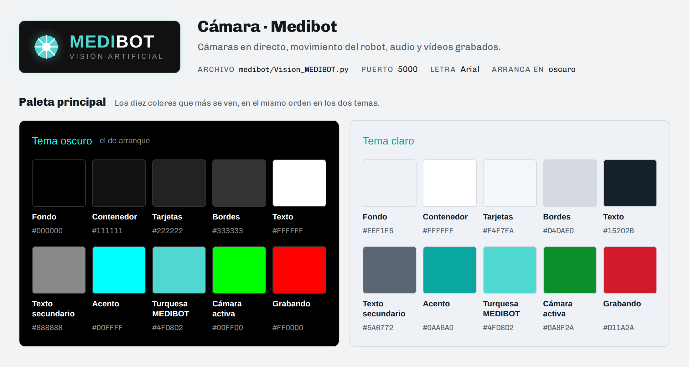
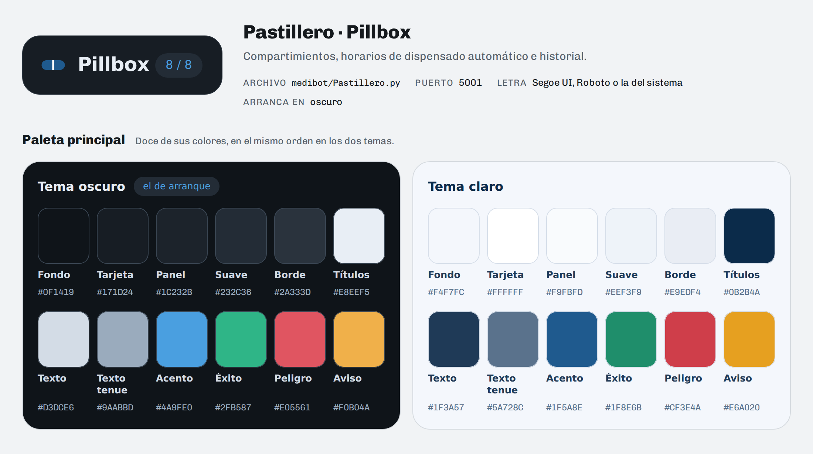

# Paleta de colores de las webs

Los colores exactos de las dos interfaces web de MEDIBOT, copiados de su CSS:

| Interfaz | Archivo | Puerto |
|---|---|---|
| Cámara (Medibot) | `medibot/Vision_MEDIBOT.py` (`HTML_TEMPLATE`) | 5000 |
| Pastillero (Pillbox) | `medibot/Pastillero.py` (`HTML_PAGE`) | 5001 |

Las dos arrancan en **tema oscuro** y tienen también **tema claro**.

* **`paleta_colores.html`**: la paleta completa, con cada color y el sitio
  donde se ve. Se abre con doble clic en cualquier navegador; pulsando un
  color se copia su código.
* **`medibot_camara.png`** y **`pastillero.png`**: la paleta principal de
  cada web, para meterla en una presentación o un documento.

Si cambia el CSS de alguna de las dos webs, esta carpeta hay que
actualizarla a mano.

## Cámara · Medibot

| Color | Oscuro (de arranque) | Claro |
|---|---|---|
| Fondo | `#000000` | `#EEF1F5` |
| Contenedor | `#111111` | `#FFFFFF` |
| Tarjetas | `#222222` | `#F4F7FA` |
| Bordes | `#333333` | `#D4DAE0` |
| Texto | `#FFFFFF` | `#15202B` |
| Texto secundario | `#888888` | `#5A6772` |
| Acento | `#00FFFF` | `#0AA6A0` |
| Turquesa MEDIBOT | `#4FD8D2` | `#4FD8D2` |
| Cámara activa | `#00FF00` | `#0A8F2A` |
| Grabando | `#FF0000` | `#D11A2A` |

Todos los colores de la cámara (45)

| Color | Dónde se ve | Oscuro | Claro |
|---|---|---|---|
| **Superficies y bordes** | | | |
| Fondo de la página | Detrás de todo | `#000000` | `#EEF1F5` |
| Contenedor | El recuadro que lo agrupa todo | `#111111` | `#FFFFFF` |
| Tarjetas y botones | Recuadros de las cámaras y del estado, botones de control, tarjetas de vídeo y los botones Pastillero y Modo | `#222222` | `#F4F7FA` |
| Casillas de dato | «Estado» y «Grabando», debajo de cada cámara | `#333333` | `#E9EEF3` |
| Botón al pasar el ratón | Botones de control y de la cabecera; también Reproducir, Descargar y la base del joystick | `#333333` | `#E3E9EF` |
| Reproducir y Descargar al pasar el ratón | Botones de cada vídeo grabado | `#444444` | `#D4DAE0` |
| Botonera de movimiento | Fondo de los botones para mover el robot | `#1A1A1A` | `#EEF4F8` |
| Bordes | Contenedor, tarjetas y botones | `#333333` | `#D4DAE0` |
| **Texto** | | | |
| Texto principal | Valores, botones, títulos de vídeo y el «BOT» del logotipo | `#FFFFFF` | `#15202B` |
| Texto secundario | Etiquetas, «VISIÓN ARTIFICIAL», «Estado Sistema» y los datos de cada vídeo | `#888888` | `#5A6772` |
| Pie de página | «Medibot», al final de la página | `#444444` | `#5A6772` |
| **Acento** | | | |
| Acento | Títulos de las cámaras, valor del estado, botón activo, bordes al pasar el ratón y joystick | `#00FFFF` | `#0AA6A0` |
| Texto sobre el acento | Letra de un botón activo | `#000000` | `#FFFFFF` |
| Letra de la botonera | Botones de movimiento y el rótulo «Velocidad» | `#00FFFF` | `#0A7C78` |
| Borde de la botonera | Botones de movimiento | `#00FFFF` | `#0AA6A0` |
| Borde de la cabecera al pasar el ratón | Botones Pastillero y Modo | `#4FD8D2` | `#0AA6A0` |
| Barra de velocidad | El deslizador para elegir la velocidad *(igual en los dos temas)* | `#00FFFF` | `#00FFFF` |
| **Marca** | | | |
| Turquesa MEDIBOT | Círculo del logo, «MEDI» del logotipo e icono de la pestaña *(igual en los dos temas)* | `#4FD8D2` | `#4FD8D2` |
| Blanco del logo | Rayos y centro del logo *(igual en los dos temas)* | `#FFFFFF` | `#FFFFFF` |
| Centro del icono de la pestaña | El punto oscuro del favicon *(igual en los dos temas)* | `#111111` | `#111111` |
| Brillo del logo | Halo alrededor del logo *(igual en los dos temas)* | `rgba(79, 216, 210, 0.45)` | `rgba(79, 216, 210, 0.45)` |
| **Estados** | | | |
| Cámara en marcha | Título de la cámara cuando está activa | `#00FF00` | `#0A8F2A` |
| Punto: cámara activa | Punto junto al título de la cámara *(igual en los dos temas)* | `#00FF00` | `#00FF00` |
| Punto: cámara parada | El mismo punto con la cámara inactiva *(igual en los dos temas)* | `#FF0000` | `#FF0000` |
| Grabando | «Sí» en Grabando y el botón de grabar mientras graba | `#FF0000` | `#D11A2A` |
| Parar | Botón PARAR de la botonera; en claro solo sale al pasar el ratón *(igual en los dos temas)* | `#FF5555` | `#FF5555` |
| Aviso de velocidad | Mensaje debajo de la barra de velocidad *(igual en los dos temas)* | `#FF6B6B` | `#FF6B6B` |
| **Barra de avisos** | | | |
| Aviso | Franja de arriba cuando algo falla *(igual en los dos temas)* | `#B3261E` | `#B3261E` |
| Aviso grave | La misma franja cuando falla la propia página *(igual en los dos temas)* | `#7F1D1D` | `#7F1D1D` |
| Sombra de la franja | Debajo de la franja *(igual en los dos temas)* | `rgba(0, 0, 0, 0.4)` | `rgba(0, 0, 0, 0.4)` |
| **Sobre el vídeo** | | | |
| Fondo del vídeo | Detrás de la imagen, en pantalla completa y en las miniaturas *(igual en los dos temas)* | `#000000` | `#000000` |
| Marco del vídeo | Borde de la imagen de la cámara *(igual en los dos temas)* | `#333333` | `#333333` |
| Texto de la miniatura | Nombre de la cámara en cada vídeo grabado *(igual en los dos temas)* | `#888888` | `#888888` |
| Botones sobre el vídeo | Altavoz, micrófono y Pantalla completa *(igual en los dos temas)* | `rgba(0, 0, 0, 0.5)` | `rgba(0, 0, 0, 0.5)` |
| Botones sobre el vídeo al pasar el ratón | Los mismos botones *(igual en los dos temas)* | `rgba(0, 0, 0, 0.75)` | `rgba(0, 0, 0, 0.75)` |
| Letra de esos botones | Texto e iconos *(igual en los dos temas)* | `#FFFFFF` | `#FFFFFF` |
| Borde de esos botones | En reposo *(igual en los dos temas)* | `rgba(255, 255, 255, 0.35)` | `rgba(255, 255, 255, 0.35)` |
| Borde al pasar el ratón o escuchando | Los mismos botones *(igual en los dos temas)* | `#4FD8D2` | `#4FD8D2` |
| Escuchando | Altavoz mientras suena el micrófono de la cámara *(igual en los dos temas)* | `rgba(10, 166, 160, 0.85)` | `rgba(10, 166, 160, 0.85)` |
| Hablando | Micrófono mientras mantienes pulsado para hablar *(igual en los dos temas)* | `rgba(214, 48, 49, 0.9)` | `rgba(214, 48, 49, 0.9)` |
| Borde al hablar | El mismo botón *(igual en los dos temas)* | `#FF7675` | `#FF7675` |
| Latido al hablar | Anillo que late alrededor del botón y se desvanece *(igual en los dos temas)* | `rgba(214, 48, 49, 0.55)` | `rgba(214, 48, 49, 0.55)` |
| Rótulo del joystick | Fondo de «Dir: …» *(igual en los dos temas)* | `rgba(0, 0, 0, 0.45)` | `rgba(0, 0, 0, 0.45)` |
| **Brillos** | | | |
| Brillo del contenedor | Halo alrededor del recuadro principal | `rgba(0, 255, 255, 0.1)` | `rgba(10, 166, 160, 0.12)` |
| Brillo del joystick | Halo de la bola del joystick | `rgba(0, 255, 255, 0.6)` | `rgba(10, 166, 160, 0.5)` |

## Pastillero · Pillbox

| Color | Oscuro (de arranque) | Claro |
|---|---|---|
| Fondo | `#0F1419` | `#F4F7FC` |
| Tarjeta | `#171D24` | `#FFFFFF` |
| Panel | `#1C232B` | `#F9FBFD` |
| Suave | `#232C36` | `#EEF3F9` |
| Borde | `#2A333D` | `#E9EDF4` |
| Títulos | `#E8EEF5` | `#0B2B4A` |
| Texto | `#D3DCE6` | `#1F3A57` |
| Texto tenue | `#9AABBD` | `#5A728C` |
| Acento | `#4A9FE0` | `#1F5A8E` |
| Éxito | `#2FB587` | `#1F8E6B` |
| Peligro | `#E05561` | `#CF3E4A` |
| Aviso | `#F0B04A` | `#E6A020` |

Las 29 variables CSS del pastillero, el anillo de foco y el icono (32)

| Variable CSS | Para qué | Oscuro | Claro |
|---|---|---|---|
| **Superficies** | | | |
| `--fondo` Fondo | Detrás de todo | `#0F1419` | `#F4F7FC` |
| `--tarjeta` Tarjeta | Recuadro principal, tarjetas de compartimiento, campos y casillas de días; también la letra de los botones de color | `#171D24` | `#FFFFFF` |
| `--panel` Panel | Formulario, datos guardados, historial y horarios | `#1C232B` | `#F9FBFD` |
| `--suave` Suave | Botones de arriba (MEDIBOT, Modo Claro…), contador de compartimientos y botones normales | `#232C36` | `#EEF3F9` |
| `--suave-hover` Suave al pasar el ratón | Los botones de arriba | `#2C3742` | `#DCE6F0` |
| `--neutro` Neutro | Etiqueta de un horario en pausa | `#232C36` | `#F0F2F6` |
| **Bordes** | | | |
| `--borde` Borde | Tarjetas, paneles y líneas entre filas | `#2A333D` | `#E9EDF4` |
| `--borde-fuerte` Borde fuerte | Campos de texto, hora, casillas de días y botones de contorno (Cancelar, Pausar) | `#3A4653` | `#D6DEE9` |
| `--borde-activo` Borde activo | Tarjeta de compartimiento al pasar el ratón | `#4E6478` | `#B6CAE0` |
| **Texto** | | | |
| `--texto-titulo` Títulos | «Pillbox», «Compartimiento N», títulos de panel y datos guardados | `#E8EEF5` | `#0B2B4A` |
| `--texto` Texto | Texto normal, número de compartimiento y etiquetas del formulario | `#D3DCE6` | `#1F3A57` |
| `--texto-tenue` Texto tenue | Subtítulos, etiquetas en mayúsculas, fechas del historial y avisos | `#9AABBD` | `#5A728C` |
| `--texto-debil` Texto débil | «Sin datos» y la letra de un horario en pausa | `#7C8B9C` | `#8A99AB` |
| **Acento** | | | |
| `--acento` Acento | Letra de los botones de arriba, botones Dispensar y Agregar horario, días del horario, campo activo y acciones MANUAL | `#4A9FE0` | `#1F5A8E` |
| `--acento-hover` Acento al pasar el ratón | Botones Dispensar y Agregar horario | `#6BB4EC` | `#164A73` |
| `--acento-suave` Acento suave | Etiqueta «Pendiente» | `#16354D` | `#DFF0FA` |
| **Éxito** | | | |
| `--exito` Éxito | Botón Completado y acciones AUTO del historial | `#2FB587` | `#1F8E6B` |
| `--exito-hover` Éxito al pasar el ratón | Botón Completado | `#46C79A` | `#167556` |
| `--exito-suave` Éxito suave | Pastillas «Conectado» y «Sincronizado», etiqueta «Completado» y horario activo | `#143529` | `#D4EDDA` |
| `--exito-texto` Letra de éxito | Texto de esas pastillas y etiquetas | `#6FDCB2` | `#0E6B3E` |
| **Peligro** | | | |
| `--peligro` Peligro | Botones Eliminar y Quitar | `#E05561` | `#CF3E4A` |
| `--peligro-hover` Peligro al pasar el ratón | Esos botones; también la letra de «Desconectado» | `#EA6F79` | `#B3323D` |
| `--peligro-suave` Peligro suave | Pastilla «Desconectado» | `#3A1A1E` | `#FDECEA` |
| **Aviso** | | | |
| `--aviso` Aviso | Botón Editar | `#F0B04A` | `#E6A020` |
| `--aviso-hover` Aviso al pasar el ratón | Botón Editar | `#F6C268` | `#CC8D1A` |
| `--aviso-suave` Aviso suave | Pastilla «Desincronizado» | `#3A2C10` | `#FDF0D5` |
| `--aviso-texto` Letra de aviso | Texto de «Desincronizado» | `#F2C87A` | `#8A5A00` |
| **Sombras** | | | |
| `--sombra` Sombra | Recuadro principal y tarjeta al pasar el ratón | `rgba(0, 0, 0, 0.55)` | `rgba(0, 20, 40, 0.12)` |
| `--sombra-suave` Sombra suave | Tarjetas de compartimiento | `rgba(0, 0, 0, 0.25)` | `rgba(0, 0, 0, 0.04)` |
| Anillo de foco | Alrededor del campo en el que escribes *(igual en los dos temas)* | `rgba(31, 90, 142, 0.12)` | `rgba(31, 90, 142, 0.12)` |
| **Icono de la pestaña** | | | |
| Pastilla | Cuerpo de la pastilla del favicon *(igual en los dos temas)* | `#1F5A8E` | `#1F5A8E` |
| Raya | Línea del centro de la pastilla *(igual en los dos temas)* | `#FFFFFF` | `#FFFFFF` |

## Qué no está

* Los colores que el CSS de la cámara guarda para piezas que la página ya
  no tiene (título grande, subtítulo, pestañas, rejilla de posición, cruceta
  de movimiento y estadísticas bajo el vídeo): `#9AA4AD`, `#FFB020` y el
  brillo `rgba(0, 255, 255, 0.5)`. No se ven en ningún sitio.
* La ventana de escritorio de Medibot (Tkinter): esta es la paleta de la web.
